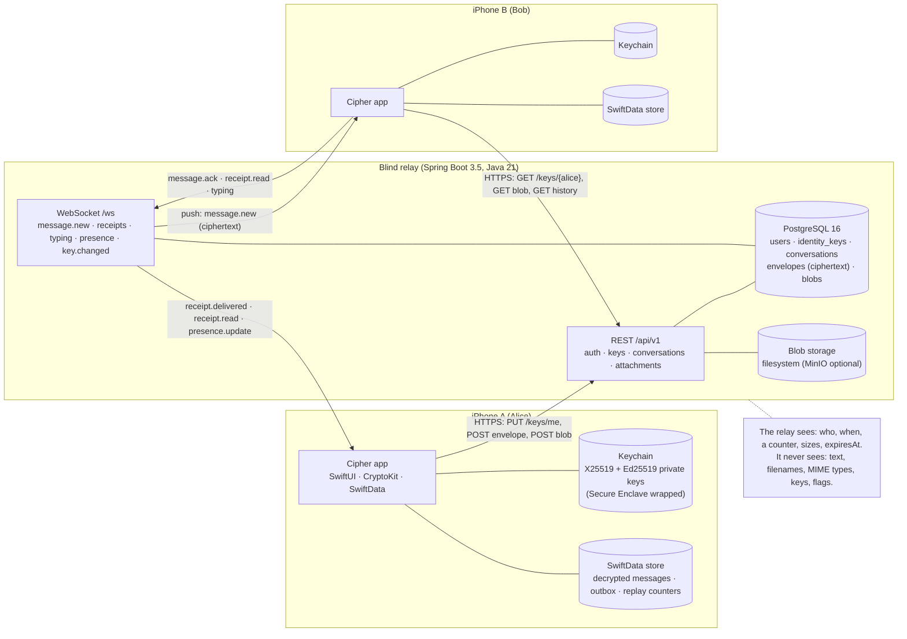
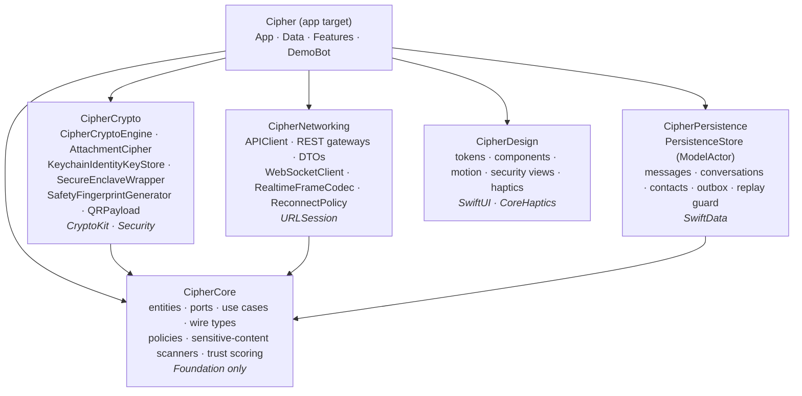
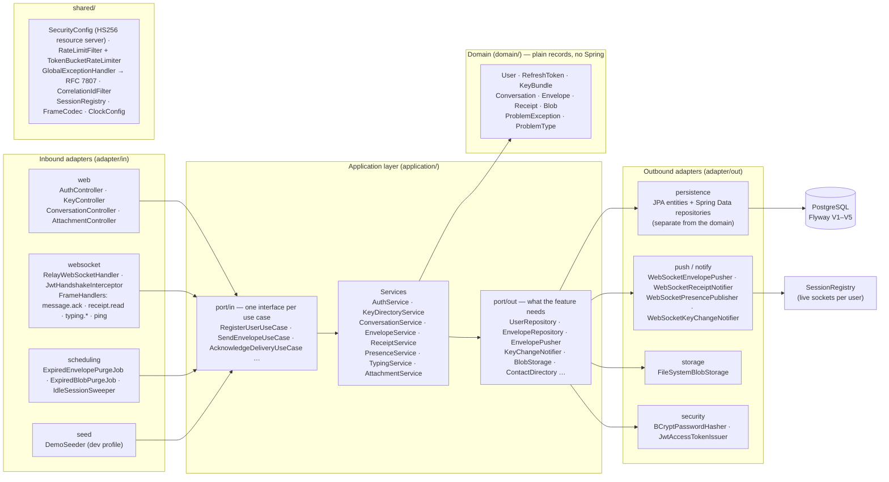
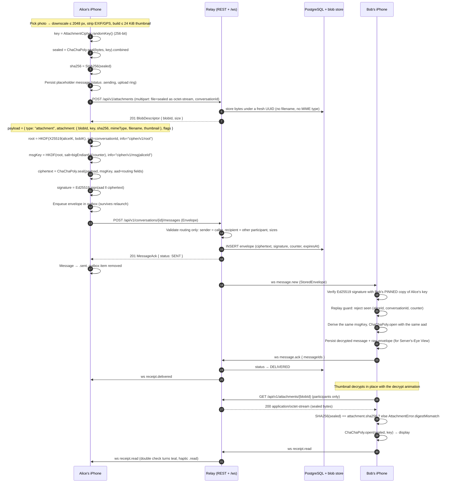
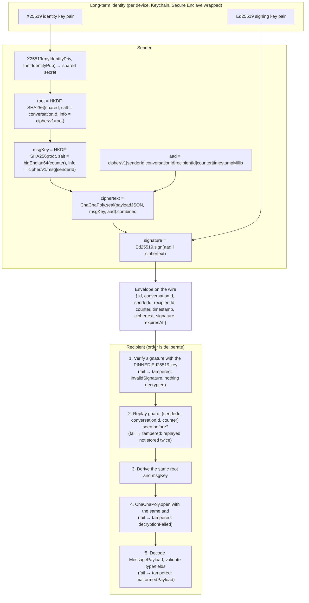

<div align="center">

# Cipher

### Security you can see and feel

End-to-end encrypted iOS messenger built with SwiftUI and CryptoKit, backed by a zero-knowledge
Spring Boot relay that never sees your messages.

[](https://github.com/frank-shema/cipher-secure-messenger/actions/workflows/backend.yml)
[](https://github.com/frank-shema/cipher-secure-messenger/actions/workflows/ios.yml)


[](LICENSE)

<table>
  <tr>
    <td align="center"><br/><sub>Decrypt animation</sub></td>
    <td align="center"><br/><sub>Server's-Eye View</sub></td>
    <td align="center"><br/><sub>Emoji verification</sub></td>
  </tr>
</table>

</div>

Cipher is a 1:1 messenger where every message, photo, reaction and flag is sealed on the sender's
phone with Apple CryptoKit and opened only on the recipient's. The relay in between authenticates
users, hands out public keys and routes opaque bytes. It has no way to read a message, and the app
goes out of its way to let you *see* that: incoming text visibly decrypts, any bubble flips over to
show exactly what the server stored, and a trust ring around every contact tells you how much of
the conversation you have actually verified.

## Table of contents

1. [Quick start](#quick-start)
2. [Architecture](#architecture)
3. [Encryption approach](#encryption-approach)
4. [Features](#features)
5. [Engineering decisions and trade-offs](#engineering-decisions-and-trade-offs)
6. [Testing](#testing)
7. [Development workflow](#development-workflow)
8. [Known limitations and future work](#known-limitations-and-future-work)
9. [Screenshots](#screenshots)

## Quick start

There are two ways to run Cipher. The fastest needs only Xcode, because the relay is already
running on a public server.

### Option A — hosted relay (2 minutes, nothing to install but Xcode)

The blind relay is deployed and reachable right now:

| | |
|---|---|
| Relay | `http://104.248.131.165:8080` |
| Swagger UI | [http://104.248.131.165:8080/swagger-ui.html](http://104.248.131.165:8080/swagger-ui.html) |
| Health | [http://104.248.131.165:8080/actuator/health](http://104.248.131.165:8080/actuator/health) |
| WebSocket | `ws://104.248.131.165:8080/ws` |

```sh
git clone https://github.com/frank-shema/cipher-secure-messenger.git
cd cipher-secure-messenger
make ios-open      # regenerates Cipher.xcodeproj from ios/project.yml and opens it in Xcode
```

Run the `Cipher` scheme on an iPhone simulator and sign in with the demo credentials below. The
app talks to the hosted relay by default (no setup); **Settings → Relay** switches to
`http://localhost:8080` when you run the backend yourself. Two simulators (or a simulator and a phone) can chat with each other through the hosted
relay, and Echo works on a single simulator. The server only ever sees ciphertext; you can prove
it by calling `GET /api/v1/conversations/{id}/messages` from Swagger with your token.

You can also poke the API without the app:

```sh
curl -s -X POST http://104.248.131.165:8080/api/v1/auth/login \
  -H 'Content-Type: application/json' \
  -d '{"username":"alice","password":"cipher-alice"}' | jq .
```

The deployment itself (Docker on an Ubuntu droplet, shared PostgreSQL, secrets in an env file,
redeploy steps) is documented in [docs/DEPLOYMENT.md](docs/DEPLOYMENT.md).

> **Build note.** Always build with normal simulator signing (Xcode's default, or the `make` targets).
> Passing `CODE_SIGNING_ALLOWED=NO` produces an unsigned app that the data-protection Keychain
> rejects with `errSecMissingEntitlement (-34018)`, so sign-in fails. The demo relay is plain `http`,
> so `Info.plist` sets `NSAllowsArbitraryLoads`; a production build would pin `https`/`wss` instead.

### Option B — everything on your machine

**Prerequisites:** Xcode 16+ (developed and tested on Xcode 27, iOS 17 deployment target), JDK 21,
Docker. `xcodegen` is used to regenerate the project (`brew install xcodegen`); `swiftlint` is
optional for `make lint`.

```sh
make up          # PostgreSQL 16 + relay on http://localhost:8080 (dev profile seeds alice, bob, echo)
make ios-open    # regenerate Cipher.xcodeproj from ios/project.yml and open it in Xcode
make seed        # wait for /actuator/health, confirm the demo users exist, print the credentials
```

Run the `Cipher` scheme on an iPhone simulator, open **Settings → Relay** and enter
`http://localhost:8080` (the default is the hosted relay). Swagger UI is at
`http://localhost:8080/swagger-ui.html`, health at `/actuator/health`. To run the relay without
Docker: `cd backend && mvn spring-boot:run -Dspring-boot.run.profiles=dev` against any
PostgreSQL 16 reachable through `DATABASE_URL`.

### Demo credentials

| username | password | role |
|---|---|---|
| `alice` | `cipher-alice` | demo user, simulator 1 |
| `bob` | `cipher-bob` | demo user, simulator 2 |
| `echo` | `cipher-echo` | demo companion bot, driven by the app's DEBUG-only `DemoBot` |

Seeding runs automatically under the `dev` profile (`DemoSeeder`, `backend/src/main/java/com/cipher/auth/adapter/in/seed`).
Passwords are BCrypt-hashed; the seed only logs usernames.

### Chat between two simulators (alice and bob)

1. Run `Cipher` on a first simulator (the Makefile defaults to `iPhone 17`), sign in as `alice`.
   The app generates an X25519 + Ed25519 identity, seals it in the Keychain and publishes the
   public halves (`PUT /api/v1/keys/me`).
2. In Xcode change the run destination to a second simulator (any other iPhone) and run again;
   sign in as `bob`.
3. On either device tap **New chat**, type the other username, and start typing. Sending is
   optimistic: the bubble appears as `sending`, the relay's ack turns it `sent`, Bob's
   `message.ack` turns it `delivered`, and his read receipt turns the double check teal.

### Chat with Echo on a single simulator

Sign in as `alice` or `bob`, open **Settings → Developer → Demo companion (Echo)** (DEBUG builds
only), then start a chat with `echo`. The `DemoBot` runs inside your app process with its own
Keychain service (`com.cipher.demo.echo`), its own in-memory store and its own WebSocket, so the
whole loop (seal → relay → push → verify → decrypt → reply) happens for real. Echo acknowledges,
shows typing, replies with an encrypted message, reads after a moment, reacts to messages
containing `!` or `❤️`, and answers `help`, `photo` (a view-once image) and `capsule` (a Time
Capsule).

### Physical device

A device cannot reach `localhost` on your Mac. Open **Settings → Relay**, enter either the hosted
relay `http://104.248.131.165:8080` or `http://<your-mac-lan-ip>:8080`, tap **Save** and relaunch
(the API client is built once at launch). The WebSocket URL is derived from the same address (`http` → `ws`, `https` → `wss`).
`Info.plist` allows plain `http` for local networking only; anything that leaves your network must
be `https`.

## Architecture

Cipher is a monorepo: `backend/` (Java 21, Spring Boot 3.5) and `ios/` (Swift 6, five local Swift
packages plus the app target). The wire contract both sides are built against is
[docs/PROTOCOL.md](docs/PROTOCOL.md); a module-by-module tour with file pointers is in
[docs/ARCHITECTURE.md](docs/ARCHITECTURE.md). Diagram sources live in `docs/diagrams/*.mmd`.

### System overview



### iOS module dependency graph

Every arrow points at an import. Only `CipherCore` sits at the centre; it depends on Foundation
alone, so use cases and the wire types compile and run on macOS without a simulator.



| Package | Owns | Imports |
|---|---|---|
| `CipherCore` | `Message`, `Conversation`, `Contact`, `Envelope`, `MessagePayload`, the port protocols (`MessageRepository`, `RealtimeGateway`, `MessageCryptoService`, …), use cases (`SendMessageUseCase`, `ReceiveEnvelopeUseCase`, `SyncConversationUseCase`, `HandleRealtimeEventUseCase`, `FlushOutboxUseCase`, `SendAttachmentUseCase`, `EvaluateTrustUseCase`, `DetectSensitiveContentUseCase`), policies (`DisappearingTimer`, `TimeCapsuleState`, `MessageVisibilityPolicy`), duress domain (`PINRules`, `DecoyInboxGenerator`) | Foundation |
| `CipherCrypto` | `CipherCryptoEngine` (PROTOCOL §4), `AttachmentCipher`, `KeychainIdentityKeyStore`, `SecureEnclaveWrapper`, `SafetyFingerprintGenerator`, `EmojiTable`, `QRPayload`, `InMemoryReplayGuard` | CipherCore, CryptoKit, Security |
| `CipherNetworking` | `APIClient` (Bearer, correlation ids, single-flight 401 refresh, RFC 7807 parsing), one `Endpoint` per route, `Remote*Gateway`s, `WebSocketClient` actor (ping/pong, backoff with full jitter, 4001 refresh), `RealtimeFrameCodec` | CipherCore, URLSession |
| `CipherPersistence` | `PersistenceStore` actor over SwiftData: repositories, outbox, replay guard, raw-envelope mirror, expiry sweep, per-account on-disk stores with `NSFileProtectionComplete` | CipherCore, SwiftData |
| `CipherDesign` | Colour/typography/spacing tokens, bubbles, avatars, `DecryptText`, `ScrambleOnSend`, `FlipCard`, `SealedCapsuleView`, `TrustRing`, `WhisperBlur`, `FlipToHideOverlay`, `PrivacyCurtain`, `LockScreenView`, `PINPadView`, `ServerEyeRawView`, `CoreHapticsEngine` | SwiftUI, CoreHaptics |
| `Cipher` (app) | Composition root (`AppContainer`, `MessagingStack`), `AppSession` state machine, `Router`, Keychain session store, token refresh adapter, and the feature folders under `ios/Cipher/Features` | all five |

### Backend hexagonal layout

Every feature under `com.cipher.<feature>` has the same shape. Cross-feature needs are ports owned
by the consumer and implemented by the owner of the data, so no feature imports another feature's
domain model.



| Feature | Responsibility | Notable pieces |
|---|---|---|
| `auth` | Registration, login, rotating refresh tokens (SHA-256 hashes at rest), logout, demo seed | `AuthService`, `JwtAccessTokenIssuer`, `DemoSeeder` |
| `keys` | Public identity key directory with explicit rotation and `key.changed` fan-out | `KeyDirectoryService`, `WebSocketKeyChangeNotifier` |
| `messaging` | Deterministic 1:1 conversations, opaque envelopes, receipts, the `/ws` endpoint | `ConversationService`, `EnvelopeService`, `ReceiptService`, `RelayWebSocketHandler` + `FrameHandler`s |
| `presence` | Online/offline fan-out to contacts, `last_seen_at`, typing relay with membership check | `PresenceService`, `TypingService` |
| `attachments` | Encrypted blob upload/download/expiry behind a `BlobStorage` port | `AttachmentService`, `FileSystemBlobStorage` |
| `shared` | Security, RFC 7807 problems, token-bucket rate limits, clock, WebSocket plumbing | `SecurityConfig`, `GlobalExceptionHandler`, `SessionRegistry`, `FrameCodec` |

Schema is Flyway-managed (`V1` baseline, `V2` users + refresh tokens, `V3` identity keys,
`V4` conversations + envelopes, `V5` blobs) with `ddl-auto=validate` catching drift. Conversation
ids are `UUID.nameUUIDFromBytes("cipher/conv/" + a + "|" + b)` over the sorted participant pair,
so two phones "creating" the same conversation at once converge without a race.

### Sequence: send an encrypted image



## Encryption approach



### In plain English

Each device makes two long-term key pairs the first time you sign in: one for agreeing on secrets
(X25519) and one for signing (Ed25519). Only the public halves ever leave the phone; they go to
the relay's key directory, and the relay refuses to silently overwrite them (a reinstall gets a
`409` and must rotate explicitly, which makes every contact's app show a red banner).

When Alice starts a chat with Bob, she fetches Bob's public keys and **pins** them. Her private
agreement key and Bob's public one produce a shared secret that only the two of them can compute.
That secret is stretched with HKDF into a per-conversation root, and every message then gets its
own key by feeding the root, the sender id and a monotonically increasing counter through HKDF
again. The message JSON (text, or an attachment descriptor with the file key inside, or a reaction,
or a system event) is sealed with ChaCha20-Poly1305. The routing fields the relay needs to see are
bound into the authentication tag as associated data, so the relay cannot re-address, reorder or
re-time an envelope without the recipient noticing. Finally the whole thing is signed with Alice's
Ed25519 key.

Bob's phone verifies the signature against the key it pinned *before* it derives anything, checks
that it has never seen this counter from Alice in this conversation, and only then decrypts. Any
failure shows a red "could not be verified" bubble naming the reason rather than silently dropping
the message. Because the message key depends on the sender id, the two directions of a
conversation use disjoint keys even though both sides hold the same root, and Alice can decrypt her
own history after a reinstall.

Photos and files use a fresh random 256-bit key per file. The file is sealed with ChaCha20-Poly1305
and uploaded as opaque bytes (no filename, no MIME type); the key, the SHA-256 of the sealed blob,
the real filename and a small thumbnail travel *inside* the message ciphertext. The recipient
verifies the digest before it spends a single cycle decrypting.

### Primitives

| Purpose | Algorithm | CryptoKit / platform API |
|---|---|---|
| Identity key agreement | X25519 | `Curve25519.KeyAgreement.PrivateKey`, `sharedSecretFromKeyAgreement(with:)` |
| Envelope signatures | Ed25519 | `Curve25519.Signing.PrivateKey.signature(for:)`, `PublicKey.isValidSignature(_:for:)` |
| Per-conversation root key | HKDF-SHA256 (salt = conversation id, info `cipher/v1/root`) | `SharedSecret.hkdfDerivedSymmetricKey(using: SHA256.self, salt:sharedInfo:outputByteCount: 32)` |
| Per-message key | HKDF-SHA256 (salt = big-endian counter, info `cipher/v1/msg\|<senderId>`) | `HKDF<SHA256>.deriveKey(inputKeyMaterial:salt:info:outputByteCount: 32)` |
| Message AEAD | ChaCha20-Poly1305 with associated data | `ChaChaPoly.seal(_:using:authenticating:)`, `ChaChaPoly.open(_:using:authenticating:)` |
| Attachment AEAD | ChaCha20-Poly1305, random 256-bit key per file, combined form `nonce ‖ ct ‖ tag` | `SymmetricKey(size: .bits256)`, `ChaChaPoly.seal(_:using:).combined` |
| Attachment integrity | SHA-256 over the sealed blob (hex in the payload) | `SHA256.hash(data:)` |
| Safety fingerprint | SHA-256 over the sorted pair of `identityKey ‖ signingKey`; first 8 bytes → 256-emoji table; full digest as hex and as 5-digit safety-number blocks | `SHA256.hash(data:)`, `EmojiTable`, `SafetyNumberFormatter` |
| Private keys at rest | Data-protection Keychain, `WhenUnlockedThisDeviceOnly`; on devices with a Secure Enclave the raw keys are additionally wrapped ECIES-style (SE P-256 ECDH → HKDF → AES-GCM) | `SecItemAdd` with `kSecUseDataProtectionKeychain`, `SecureEnclave.P256.KeyAgreement.PrivateKey`, `AES.GCM.seal` |
| Session tokens at rest | Keychain, one JSON item | `KeychainSessionStore` |
| Local database at rest | SwiftData store under `Application Support/Cipher/<accountId>/` with `NSFileProtectionComplete`, excluded from backup | `PersistenceConfiguration.onDisk(accountId:)` |
| Relay: passwords | BCrypt | Spring Security `BCryptPasswordEncoder` |
| Relay: refresh tokens | 32 random bytes; only the SHA-256 hex digest is stored; rotated on every use | `RefreshTokenSecrets` |
| Relay: access tokens | JWT HS256, 15 min, `iss=cipher-relay` | Spring Security OAuth2 resource server (`NimbusJwtEncoder` / `NimbusJwtDecoder`) |

### Threat model

**What is protected, and against whom**

| Asset | Relay operator / database dump | Passive network observer (with TLS) | Active relay that re-addresses, reorders or replays | Someone holding the locked phone |
|---|---|---|---|---|
| Message text, captions, reactions, system events | ciphertext only | ciphertext only | AEAD tag over routing fields fails; replay guard rejects seen counters | Keychain and store are `WhenUnlocked` / `FileProtectionComplete` |
| Attachment bytes, filename, MIME type | opaque blob + byte count | opaque blob | digest mismatch is refused before decryption | same |
| Per-message flags (whisper, view-once, disappear-after, Time Capsule `unlockAt`) | inside the ciphertext | inside the ciphertext | inside the ciphertext | same |
| Who talks to whom, when, how often, how big | **visible** (this is the relay's routing metadata) | visible to the relay, not to the network under TLS | n/a | n/a |
| Identity keys | public halves only | public halves only | a substituted key is **detectable** (fingerprint mismatch, `key.changed` banner, Trust Ring drops) but not prevented without verification | private halves Secure Enclave wrapped |

**Honesty section.** Cipher's envelope design is inspired by Signal, but it is **not** the Signal
protocol and does not claim to be. There are no prekeys and no Double Ratchet: the per-conversation
root is derived from two static identity keys, and the per-message key is a deterministic function
of that root and a counter. If a device's identity private key leaks, every message that device
ever sent or received in that conversation can be decrypted, past and future, until both parties
rotate. The design is deliberately small enough to read in one sitting
(`ios/Packages/CipherCrypto/Sources/CipherCrypto/Engine`), and every primitive is Apple CryptoKit;
nothing is home-grown.

**Guarantees (as built)**

- **Confidentiality** of everything inside the payload, against the relay and the network.
- **Integrity** of ciphertext *and* routing metadata via the AEAD's associated data.
- **Authenticity**: every envelope is signed with a key the recipient pinned; a substituted or
  forged sender fails verification before decryption is attempted.
- **Per-message keys**: distinct keys per counter and per direction, so one message never
  reveals another's key.
- **Replay protection**: `(senderId, conversationId, counter)` triples are persisted in the
  SwiftData store and re-sends are surfaced as `tampered(.replayed)` rather than shown twice, even
  across relaunches.
- **Key-change visibility**: a directory answer or a `key.changed` push that differs from the pinned
  material flips the contact to `keyChanged`; the chat shows a red banner and the Trust Ring is
  capped at "low" until you re-verify.

**Non-goals (as built)**

- Forward secrecy and post-compromise security (see above).
- Multi-device: one identity per device; a second device hits `409 keys-already-registered` and
  must rotate, which every contact sees.
- Metadata privacy from the relay: it knows the participant pair, timing, sizes and `expiresAt`.
- Server-enforced time locks: `unlockAt` for Time Capsules lives inside the ciphertext and is a
  promise the *client* keeps; `expiresAt` is the one relay-visible instant and only drives the
  relay's own purge.
- Deniability, group chats, and protection against a compromised or jailbroken endpoint.

**What production would add:** X3DH for asynchronous session setup with signed prekeys and
one-time prekeys, the Double Ratchet for forward secrecy and self-healing, sealed sender so the
relay does not learn the sender of an envelope, APNs with content-free notifications, a key
transparency log so a substituted key is publicly auditable rather than merely detectable, TLS
certificate pinning, and device linking with per-device keys.

## Features

### Core

- [x] Register / log in with rotating refresh tokens; sessions stored in the Keychain; single-flight refresh on 401
- [x] Identity key generation on device, Secure Enclave wrapping, publish public halves; `409` conflict → explicit rotation
- [x] Username lookup, key pinning, deterministic 1:1 conversations
- [x] E2EE text with optimistic sending, durable outbox, ordered flush after reconnect, retry from the bubble
- [x] Replies (quoted) and reactions (six-emoji palette, toggle to remove) as protocol payload types
- [x] Delivery pipeline: `sending → sent → delivered → read`, never downgraded when receipts arrive out of order
- [x] Typing indicators (debounced start/stop, auto-clear), presence with last-seen
- [x] History sync newest-first until known ids appear, own history decrypted after reinstall
- [x] WebSocket with ping every 25 s, dead-socket recycling after two missed pongs, exponential backoff with full jitter, token refresh on `4001`
- [x] Encrypted attachments (photos and files): per-file key, opaque upload with progress ring, digest check before decryption, thumbnails inside the ciphertext
- [x] RFC 7807 errors surfaced with the relay's correlation id; rate limits on auth, sends, uploads and socket frames
- [x] Tampered-message bubbles that name the reason (`invalidSignature`, `replayed`, `decryptionFailed`, `malformedPayload`, `unknownSender`)
- [x] Dark-first design system that reads well in light mode; Dynamic Type; Reduce Motion alternatives for every animation; VoiceOver labels and custom actions

### Creativity

#### A. Make encryption visible

**Decrypt animation** · `docs/gifs/decrypt-animation.gif`, `docs/screenshots/chat-dark.png`
What: incoming text renders as cipher glyphs and resolves left to right into plaintext with a teal flash per character, once per message; outgoing text pulses through a "sealing" scramble while it is still `sending`.
Why: the message really was just decrypted on this device, and showing that beats a padlock icon.
How: `DecryptText` in CipherDesign drives a `TimelineView(.animation)` from a deterministic `DecryptSchedule`; `ScrambleOnSend` is an `Animatable` `ViewModifier`; the reveal is tracked per message id in `ChatViewModel.revealedMessageIds`; Reduce Motion crossfades instead.

**Server's-Eye View** · `docs/gifs/servers-eye.gif`, `docs/screenshots/servers-eye-dark.png`
What: long-press any bubble to flip it over and see the exact envelope the relay stored (ids, counter, timestamp, base64 ciphertext, signature); the header's eye toggle opens a full-screen split with "what you see" beside "what the server stores", aligned message for message.
Why: "the server can't read this" is a claim; a hex dump of what it actually holds is evidence.
How: `PersistenceStore` mirrors the raw envelope JSON next to every decrypted message (`attachRawEnvelope`, `rawEnvelope(messageId:)`); `FlipCard` renders `ServerEyeRawView`; `ServersEyeView` keeps both columns in one `ScrollView` so they cannot scroll apart.

**Emoji safety fingerprint** · `docs/gifs/emoji-verification.gif`, `docs/screenshots/verify-dark.png`
What: eight emoji (and a 5-digit-block safety number) computed from both parties' pinned keys, identical on both phones; scan the other person's QR or confirm out loud to mark the contact verified.
Why: the only defence against a relay that swaps keys is comparing them out of band, and emoji are easier to read across a table than hex.
How: `SafetyFingerprintGenerator` (SHA-256 over the sorted `ik ‖ sk` pair, first 8 bytes into a curated 256-entry `EmojiTable`), `QRPayload` (`cipher:verify?v=1&uid=&ik=&sk=` base64url), `AVCaptureSession` scanner in `Features/Verify/Scanner`, `VerifyContactUseCase` sets `TrustState.verified`.

**Trust Ring** · `docs/screenshots/trust-dark.png`
What: an eight-segment ring around the contact's avatar fills from red through amber to teal as the conversation earns trust; tapping it opens "Why this chat is secure" with every protection as a check or a cross and the action that flips it.
Why: security is a spectrum, and a meter that explains its own score teaches more than a badge.
How: `EvaluateTrustUseCase` + `TrustEvaluator` in CipherCore (weights: verification 0.40, key stability 0.20, disappearing 0.20, metadata stripping 0.20; a recent key change caps the level at low), `TrustRing` in CipherDesign, `TrustSheetView` re-scores live as the contact changes.

#### B. Protect the human

**Privacy-aware attachments** · `docs/screenshots/attachment-dark.png`
What: photos are downscaled to at most 2048 px and stripped of EXIF, GPS and camera metadata before they are sealed; view-once media hides behind a blurred overlay until tapped and cannot be reopened, on either side.
Why: a photo's metadata says where you were and what you own; the relay never sees it, and neither should the recipient by accident.
How: `SendAttachmentUseCase` (placeholder row → seal → upload → send with the same message id, in-memory retry), `AttachmentLimits`, `ViewOnceOverlay`, `MessageVisibilityPolicy` marks an opened view-once as consumed.

**Sensitive-content guard** · `docs/screenshots/sensitive-guard-dark.png`
What: while you type, the composer notices passwords, card numbers, IBANs and one-time codes and offers to send them as view-once with a one-minute auto-delete.
Why: the most damaging messages are the ones people send in a hurry to themselves and forget about.
How: all on device: CipherCore scanners (keyword windows, Shannon entropy, Luhn, IBAN mod-97), Foundation `NSDataDetector` to veto links and phone numbers, `NLTagger` to drop names and dictionary words, debounced on the `SensitiveContentGuard` actor; the draft is never logged or sent anywhere.

**Shoulder-surf protection** · `docs/screenshots/whisper-dark.png`, `docs/screenshots/privacy-curtain-dark.png`, `docs/screenshots/lock-screen-dark.png`
What: **whisper** messages stay blurred until the reader holds the bubble; **flip-to-hide** curtains the whole app the moment the phone is placed face down; the **privacy screen** replaces the app-switcher snapshot with the Cipher wordmark and glyph rain; **biometric lock** puts Face ID / a PIN in front of the inbox.
Why: the person reading over your shoulder is the threat encryption does nothing about.
How: `whisperBlur` modifier with a hold gesture and a VoiceOver "Reveal" action; `FlipToHideMonitor` samples Core Motion gravity at 10 Hz with hysteresis (0.8 hide / 0.5 show) and `privacyGuard` applies `flipToHide` plus `PrivacyCurtain` whenever the scene is not active; `LockScreenView` + `PINPadView` with `PINAttemptPolicy` lockouts, `NSFaceIDUsageDescription` declared.

**Disappearing messages and Time Capsules** · `docs/screenshots/disappearing-dark.png`, `docs/screenshots/time-capsule-dark.png`
What: a per-conversation timer (30 s to 1 day) deletes messages on both phones after they are read, with a countdown ring on each bubble; a Time Capsule is sealed in a wax-stamped envelope on the recipient's phone and cracks open with the decrypt animation at the instant you chose.
Why: not everything should live forever, and some things should arrive exactly on a birthday.
How: `DisappearingTimer` and `TimeCapsuleState` policies in CipherCore; the timer change travels as an encrypted `disappearing_changed` system message so both transcripts agree; `ExpiryScheduler` sweeps every 5 s while a chat is open and immediately on foreground; `SealedCapsuleView` with `unlockAt` inside the ciphertext (the relay only ever sees `expiresAt`).

**Duress PIN** · `docs/screenshots/decoy-inbox-dark.png`
What: a second PIN opens a believable decoy inbox of boring, fictional conversations; nothing on screen hints that another mode exists.
Why: when someone forces the phone open, the safest inbox is one with nothing worth pressing for.
How: `PINVerifier` answers `.real`, `.decoy` or `nil` (a wrong PIN and a missing decoy are indistinguishable), `PINRules` refuses predictable or matching PINs with constant-time comparison, `DecoyInboxGenerator` builds the same inbox for the same seed with a `SplitMix64` generator and never persists it.

#### C. Delight

**Haptic language** · `docs/screenshots/chat-dark.png`
What: nine semantic haptic patterns, from a light tick on `sent` and a rising triple on `read` to a warm confirmation on `verified`, a sharp double buzz on `warning`, a low rumble under a whisper reveal and a crack on `capsuleUnlock`.
Why: security events should be felt without being looked at.
How: `HapticPatternLibrary` expresses each pattern as AHAP-style transient and continuous events; `CoreHapticsEngine` plays them through `CHHapticEngine`, restarts after a reset and falls back to `UIImpactFeedbackGenerator`; every screen takes a `HapticEngine` so previews use `NoopHapticEngine`.

**Echo** · `docs/screenshots/echo-dark.png`
What: a DEBUG-only companion that signs in as `echo`, holds its own keys and store, and replies to you through the real relay: it acks, types, answers, reads, reacts, quotes your replies, and sends a view-once photo or a Time Capsule on request.
Why: a messenger demo with one phone is a monologue; Echo makes the whole pipeline visible on a single simulator.
How: a `DemoBot` actor compiled under `#if DEBUG` with `KeychainIdentityKeyStore(service: "com.cipher.demo.echo")`, `PersistenceStore.inMemory`, its own `WebSocketClient`, toggled from Settings and persisted in `AppPreferences`.

## Engineering decisions and trade-offs

**SwiftUI + `@Observable` (Observation framework), Swift 6 strict concurrency.** View models are
`@MainActor @Observable final class`es, views are dumb, and heavy work (crypto, JSON, image
processing, sensitive-content scanning) runs on actors or `Task.detached`. Strict concurrency
caught real bugs at compile time (a `UserDefaults`-holding struct that needed an explicit
`@unchecked Sendable`, actors for every store). The cost is iOS 17 as the floor and a few
`ModelActor` conformances written by hand because the macro cannot initialise extra properties.

**Raw WebSocket instead of STOMP.** The realtime contract is ten frame types with flat JSON payloads.
STOMP would add subscription and broker semantics we do not need, and there is no STOMP client in
the iOS SDK, which would have broken the zero-dependency rule. A raw `TextWebSocketHandler` gives
full control over handshake authentication (`Authorization` header or `?token=`), private close
codes (`4001`, `4008`), a per-user frame budget and per-event `FrameHandler` strategies;
`URLSessionWebSocketTask` speaks it natively.

**Hexagonal backend, package by feature.** Every feature is `domain / application (ports in, ports
out) / adapter (in, out)`. JPA entities are separate from domain records; cross-feature needs are
ports owned by the consumer (`keys` and `presence` both ask "who are this user's contacts" and
`messaging` answers through one adapter). The overhead is more files per feature; the payoff is
that use cases are unit-testable without Spring and the blob store, the pusher and the notifier can
be swapped without touching a service.

**Zero third-party dependencies on iOS.** CryptoKit, URLSession, SwiftData, SwiftUI, Core Haptics,
AVFoundation, Core Motion, Natural Language. No Lombok on the backend either. The trade-off is
writing a multipart encoder, a reconnect policy, a Keychain wrapper and a QR scanner by hand; the
gain is an auditable supply chain for an app whose whole point is that you can read what it does.

**Client-side enforcement of time locks.** The relay cannot see `unlockAt` (it is inside the
ciphertext), so a Time Capsule is a promise the recipient's app keeps; a modified client could open
it early. Putting the lock inside the ciphertext was chosen over a server-held timer because the
alternative hands the relay both the fact that a timer exists and the power to release early.
`expiresAt` is the single content-related field the relay sees, and only so it can purge.

**REST to send, WebSocket to receive, `message.ack` as delivery confirmation.** HTTP gives sending
idempotency (client-generated ids: `201` stored, `200` duplicate), clear failures (`413`, `429`,
`403` as problem+json) and a durable outbox with ordered flush. Push is inherently lossy, so the
recipient acks only after the envelope is persisted; the relay marks `DELIVERED` on that ack,
derives `receipt.delivered` for the sender, and re-pushes anything unacked on the next connect. One
mechanism serves delivery status, at-least-once delivery and reconnect catch-up.

**GitHub Flow, not Git Flow or trunk-based.** One `main` that always builds, short-lived
`type/scope-description` branches, pull requests with merge commits, branches kept after merge for
review, tags for releases. Git Flow's `develop`/`release`/`hotfix` branches exist to maintain
several shipped versions at once, which a single app with a single deployment does not need.
Trunk-based development with feature flags removes the review checkpoint that a portfolio project
is largely about.

## Testing

Honest current state:

- **Backend:** `mvn -B -ntp verify` runs 19 test classes across three kinds: plain unit tests
  (`AuthServiceTest`, `KeyDirectoryServiceTest`, `TokenBucketRateLimiterTest`, `JwtIssuerTest`,
  `RefreshTokenSecretsTest`, `KeyBundleTest`, `ProblemTypeTest`, …), `@WebMvcTest` slices
  (`AuthControllerTest`, `KeyControllerTest`, `RateLimitFilterTest`) and `@SpringBootTest` +
  Testcontainers PostgreSQL integration tests (`AuthAndKeysFlowIntegrationTest`,
  `AuthRateLimitIntegrationTest`, `CipherRelayApplicationTests`). Coverage is the auth and key
  directory features plus the shared security, rate-limit and error layers. The messaging,
  presence, WebSocket and attachment features were built and exercised end to end against a live
  relay (login, key upload, conversation, envelope, history, socket handshake, blob round trip) but
  have no automated suites yet.
- **iOS:** each package has a compiling Swift Testing target. `CipherDesign` has real tests for
  the deterministic decrypt schedule, Trust Ring tiers, countdown formatting and token monotonicity;
  `CipherCore`, `CipherCrypto`, `CipherNetworking`, `CipherPersistence` and the app target hold
  placeholder tests. The behavioural checks used during development (envelope round trip, tamper
  and replay rejection, frame codec for every event, 401 refresh-and-retry, multipart bytes,
  reconnect policy, SwiftData counters and outbox) ran as throwaway scripts and are the first
  suites to reinstate in the hardening pass.
- **CI:** both workflows build on every pull request and block on compilation, lint and the Docker
  image; the test steps run with `continue-on-error: true` until the suites above land, and say so
  in a comment.

How to run:

```sh
make test            # backend + iOS
make test-backend    # cd backend && mvn -B -ntp verify   (Docker needed for Testcontainers)
make test-ios        # swift test for CipherCore and CipherCrypto, then xcodebuild test on the simulator
make lint            # swiftlint --strict from ios/
```

## Development workflow

- **GitHub Flow.** `main` is always buildable. Work happens on `type/scope-description` branches
  (`feature/backend-relay-and-attachments`, `feature/ios-onboarding-and-keys`) merged through pull
  requests with a **merge commit**; branches are kept after merge so the review stays navigable.
- **Conventional Commits** with scopes `ios | backend | crypto | protocol | ci | docs | infra`, for
  example `feat(backend): add encrypted attachment upload, download and expiry` or
  `docs(backend): describe the hexagonal layout, run instructions and profiles`.
- **Pull request template** ([.github/pull_request_template.md](.github/pull_request_template.md)):
  summary and phase, why, what changed by module, how to test, screenshots for UI changes, a
  security-considerations section (keys, plaintext, logging, auth, storage, replay) and a checklist
  that includes "no plaintext or key material logged" and "CHANGELOG updated under Unreleased".
- **Versioning:** SemVer, tags `v0.1.0 … v1.0.0`, [CHANGELOG.md](CHANGELOG.md) in Keep a Changelog
  format with compare links.
- **Branch protection:** `main` requires a pull request and passing CI (enabled by the repository
  owner). CI is [backend.yml](.github/workflows/backend.yml) (JDK 21, `mvn verify`, Docker image
  build) and [ios.yml](.github/workflows/ios.yml) (`swift build`/`swift test` per package on macOS,
  `xcodegen` + `xcodebuild` for the app, SwiftLint strict).
- **Contract first:** [docs/PROTOCOL.md](docs/PROTOCOL.md) is authoritative; a change to the wire
  format lands there in the same pull request as the code, on both sides.
- **Logging rule:** ids, counts, sizes and versions only. Never plaintext, ciphertext, signatures,
  tokens, password hashes or key bytes, on either side.

## Known limitations and future work

| Limitation | How it would be solved |
|---|---|
| No forward secrecy or post-compromise security: static identity keys plus a counter | X3DH session setup with signed and one-time prekeys served by the key directory, then the Double Ratchet per conversation; the `MessageCryptoService` port and `EnvelopeHeader` are the seams |
| One device per account; a second device gets `409` and must rotate, which flags every contact | Device linking: per-device key bundles under one account, `KeyBundle` lists devices, senders encrypt once per device |
| The relay sees participants, timing and sizes | Sealed sender (encrypt the sender id to the recipient, authenticate with a delivery token), padded ciphertext lengths |
| No push notifications; a backgrounded app receives nothing until it reconnects | APNs with content-free pushes that only wake the socket; the unacked-envelope replay already handles catch-up |
| Time Capsules and disappearing timers are enforced by the client only | Would need the relay to hold a key share released at `unlockAt`, which leaks the timer to the relay; accepted as a non-goal, documented instead |
| Backend tests cover auth and keys; messaging, presence, WebSocket and attachments have none; iOS suites are placeholders | Hardening pass: Testcontainers tests over `/ws` with a Java WebSocket client, `@WebMvcTest` for the conversation and attachment controllers, Swift Testing suites for the crypto engine, codecs, use cases and ViewModels, then flip CI's `continue-on-error` off |
| Rate limits and the WebSocket `SessionRegistry` are in-process, so the relay runs as a single instance | Redis-backed buckets and a pub/sub fan-out (or sticky sessions) for the pusher and notifier ports |
| Auth rate limit keys on `remoteAddr`; behind a proxy every client shares one bucket | Configure `server.forward-headers-strategy` on the proxy host; the filter deliberately ignores `X-Forwarded-For` because it is client-controlled |
| Blob storage is the container's filesystem | Implement the `BlobStorage` port over S3/MinIO; `docker compose --profile minio` already starts one |
| No reachability monitor: reconnects keep backing off at the 30 s cap while offline | `NWPathMonitor` in the app layer driving `connect()` / `disconnect()` |
| Changing the relay address in Settings needs a relaunch | Rebuild `APIClient` and `WebSocketClient` behind the `MessagingStack` on change |
| Sensitive-content detection is heuristic and English-leaning | An on-device Core ML classifier trained on secret-like strings, keeping the same `SensitiveContentDetecting` port |
| The decoy inbox is in memory; a forensic image of the device still finds the real store | Plausibly deniable storage is out of scope; the duress mode targets coercion at the screen, not lab analysis |
| Reactions carry no sender, so a 1:1 reaction cannot say who reacted | Add `byUserId` to the `reaction` payload in protocol v2 |
| Simulator and some Macs have no Secure Enclave or motion hardware | Keys are stored raw in the Keychain and flip-to-hide is inert; both report themselves unavailable rather than pretending |
| English only | Every user-facing string already goes through String Catalogs (`Localizable.xcstrings` per module); translations are a resource change |

## Screenshots

Captured from the iPhone simulator in both appearances (`docs/screenshots/<screen>-dark.png`
and `docs/screenshots/<screen>-light.png`).

| Screen | Dark | Light |
|---|---|---|
| Welcome |  |  |
| Register / log in |  |  |
| Key generation |  |  |
| Conversations |  |  |
| Chat |  |  |
| Server's-Eye View |  |  |
| Verify (emoji + QR) |  |  |
| Trust Ring sheet |  |  |
| Attachment |  |  |
| Sensitive-content guard |  |  |
| Whisper |  |  |
| Disappearing messages |  |  |
| Time Capsule |  |  |
| Privacy curtain |  |  |
| Lock screen |  |  |
| Decoy inbox |  |  |
| Echo |  |  |
| Settings |  |  |

## Documents

- [docs/PROTOCOL.md](docs/PROTOCOL.md): REST + WebSocket contract, payload schema, envelope cryptography, problem types
- [docs/ARCHITECTURE.md](docs/ARCHITECTURE.md): module-by-module tour with file pointers
- [backend/README.md](backend/README.md): relay layout, profiles, configuration, running without Docker
- [CHANGELOG.md](CHANGELOG.md)

## License

[MIT](LICENSE)
